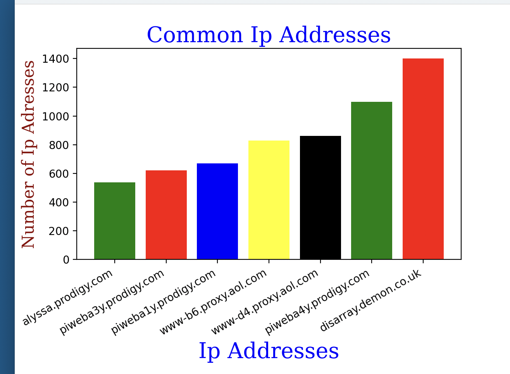
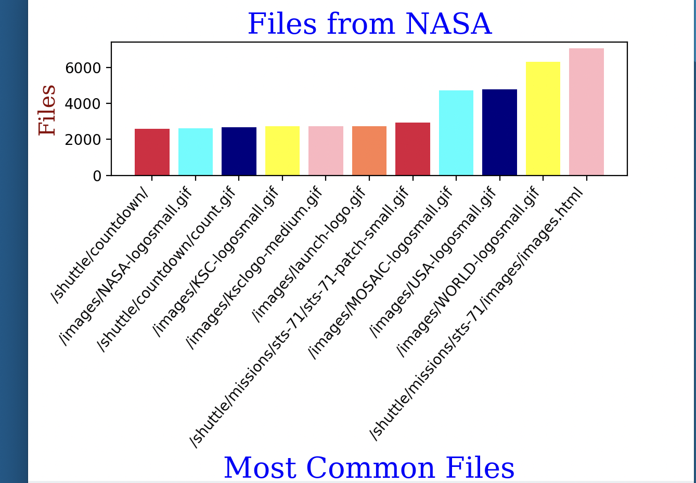

# Introduction
I analyzed the web server log from July of 1995 to identify the most common logs from NASA and what i am analyzed is The Ip Addresses and The files. See the graphs before to see what the information for the data collected. 

## Graph __blank__ data

The first thing I analyzed was the flow of traffic via the DNS addresses. A DNS is what translates the domain names to the respective IP address so that browsers can access the resources.  and tells us what Ip addresses where used during this Log. This is what I found: (Provide at least 3 things.) 

-This Most visited disarray.demon.co.uk 

-This Least visited alyssa.prodigy.com

-We have the dns range from 500 to 1400 to get the most common Ip addresses.

## Graph __blank__ data

The second thing I analyzed was the files from july NASA log Analying the time to gives us a better understanding of the files. This is what I found: (Provide at least 3 things.) 

-The Most visited /shuttle/missions/sts-71/images/images.html

-The least visited /shuttle/countdown/

-We have the dns range 2500 to 6000 to get the most common files 

## Suggestions
Based on my analysis, to increase our web traffic, we can
set a values to get the most common values that are being used in the log without having to look at it all one by one
